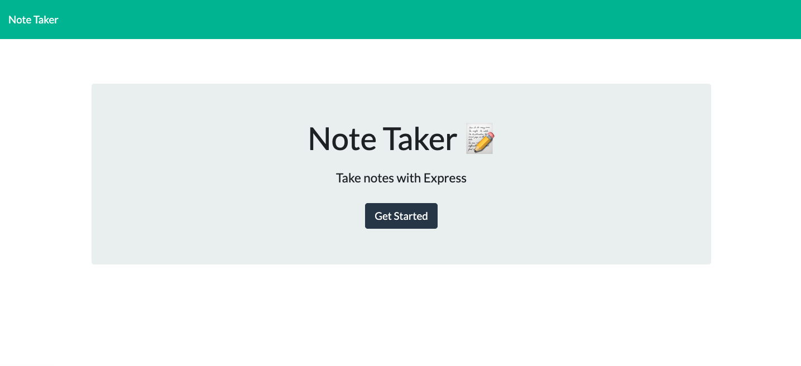

# Note Taker

This is a note taker that should allow the user to write, save, and delete notes. Unfortunately, there are still some glitches that need to be resolved such a new notes not displaying to the page despite being pushed into the db.json file. 


#### **Deployed Link**

* [See Live Site](https://git.heroku.com/stormy-bastion-03237.git)




## **Built With**
* [HTML](https://developer.mozilla.org/en-US/docs/Web/HTML)
* [CSS](https://developer.mozilla.org/en-US/docs/Web/CSS)
* [JavaScript](https://www.javascript.com/)
* [Express.js](https://expressjs.com/)
* [GitHub](https://github.com/)
* [Node.js](https://nodejs.org/en/)
*  Git - used to track changes to code
______________________________________________________________________________
  
### **Installation**

If you're accessing the code and not the deployed site, you'll need to run 'npm install express' in your Terminal or Bash to assure that you have the proper dependencies.  

______________________________________________________________________________

#### **Code Snippet**

The code below displays the minimum requirements for the application to function. 
```
const express = require("express");
const fs = require("fs");
const path = require("path");

// Tells node that we are creating an "express" server
const app = express();

// Sets an initial port, listens in your browser.
const PORT = process.env.PORT || 4040;

// Sets up the Express app to handle data parsing.
app.use(express.urlencoded({ extended: true }));
app.use(express.json());
app.use(express.static("public"));

```
______________________________________________________________________________
### **Author Links**

* **PAMELA GUTIERREZ**
* **UC Berkeley Coding Bootcamp**
  
- [Link to Portfolio Site](https://pamela-gutierrez.github.io/updated-portfolio/)
- [Link to Github](https://github.com/pamela-gutierrez) 
- [Link to LinkedIn](www.linkedin.com/in/pamela-gutierrez)


______________________________________________________________________________

#### **License**

This project is licensed under the MIT License
